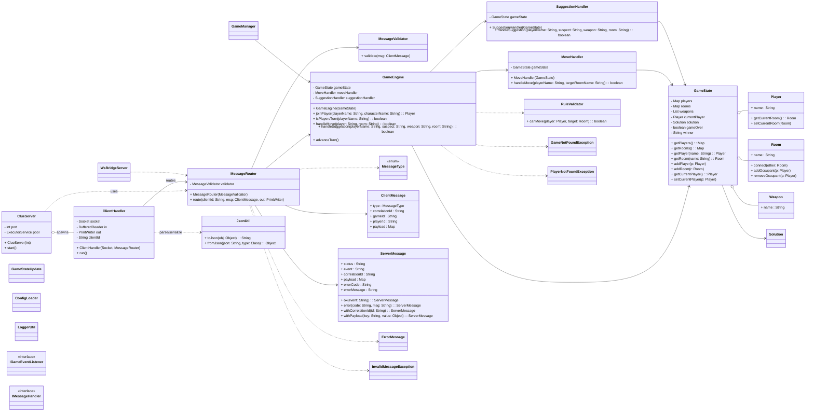

# Clue-Less Server – Static Class Design (UML)

```mermaid
classDiagram
    direction LR

    class ClueServer {
      - int port
      - ExecutorService pool
      + ClueServer(int)
      + start()
    }

    class ClientHandler {
      - Socket socket
      - BufferedReader in
      - PrintWriter out
      - String clientId
      + ClientHandler(Socket, MessageRouter)
      + run()
    }

    class MessageRouter {
      - MessageValidator validator
      + MessageRouter(MessageValidator)
      + route(clientId: String, msg: ClientMessage, out: PrintWriter)
    }

    class MessageValidator {
      + validate(msg: ClientMessage)
    }

    class GameEngine {
      - GameState gameState
      - MoveHandler moveHandler
      - SuggestionHandler suggestionHandler
      + GameEngine(GameState)
      + joinPlayer(playerName: String, characterName: String) : Player
      + isPlayersTurn(playerName: String) : boolean
      + handleMove(player: String, room: String) : boolean
      + handleSuggestion(playerName: String, suspect: String, weapon: String, room: String) : boolean
      + advanceTurn()
    }

    class GameState {
      - Map players
      - Map rooms
      - List weapons
      - Player currentPlayer
      - Solution solution
      - boolean gameOver
      - String winner
      + getPlayers() : Map
      + getRooms() : Map
      + getPlayer(name: String) : Player
      + getRoom(name: String) : Room
      + addPlayer(p: Player)
      + addRoom(r: Room)
      + getCurrentPlayer() : Player
      + setCurrentPlayer(p: Player)
    }

    class MoveHandler {
      - GameState gameState
      + MoveHandler(GameState)
      + handleMove(playerName: String, targetRoomName: String) : boolean
    }

    class SuggestionHandler {
      - GameState gameState
      + SuggestionHandler(GameState)
      + handleSuggestion(playerName: String, suspect: String, weapon: String, room: String) : boolean
    }

    class RuleValidator {
      + canMove(player: Player, target: Room) : boolean
    }

    class Player {
      + name : String
      + getCurrentRoom() : Room
      + setCurrentRoom(Room)
    }

    class Room {
      + name : String
      + connect(other: Room)
      + addOccupant(p: Player)
      + removeOccupant(p: Player)
    }

    class Weapon {
      + name : String
    }

    class Solution

    class GameManager

    class MessageType {
      <<enum>>
    }

    class ClientMessage {
      + type : MessageType
      + correlationId : String
      + gameId : String
      + playerId : String
      + payload : Map
    }

    class ServerMessage {
      + status : String
      + event : String
      + correlationId : String
      + payload : Map
      + errorCode : String
      + errorMessage : String
      + ok(event: String) : ServerMessage
      + error(code: String, msg: String) : ServerMessage
      + withCorrelationId(id: String) : ServerMessage
      + withPayload(key: String, value: Object) : ServerMessage
    }

    class ErrorMessage
    class GameStateUpdate

    class JsonUtil {
      + toJson(obj: Object) : String
      + fromJson(json: String, type: Class) : Object
    }

    class ConfigLoader
    class LoggerUtil

    class IGameEventListener {
      <<interface>>
    }

    class IMessageHandler {
      <<interface>>
    }

    class WsBridgeServer

    class GameNotFoundException
    class InvalidMessageException
    class PlayerNotFoundException

    %% Relationships
    ClueServer o-- ClientHandler : spawns
    ClueServer ..> MessageRouter : uses

    ClientHandler --> MessageRouter : routes
    ClientHandler ..> JsonUtil : parse/serialize

    MessageRouter --> MessageValidator
    MessageRouter --> ClientMessage
    MessageRouter --> ServerMessage
    MessageRouter ..> ErrorMessage
    MessageRouter --> GameEngine
    MessageRouter ..> MessageType

    GameEngine --> GameState
    GameEngine --> MoveHandler
    GameEngine --> SuggestionHandler
    GameEngine ..> RuleValidator

    MoveHandler --> GameState
    SuggestionHandler --> GameState

    GameState o-- Player
    GameState o-- Room
    GameState o-- Weapon
    GameState --> Solution

    GameManager --> GameEngine

    WsBridgeServer ..> MessageRouter

    GameEngine ..> GameNotFoundException
    MessageRouter ..> InvalidMessageException
    GameEngine ..> PlayerNotFoundException
```