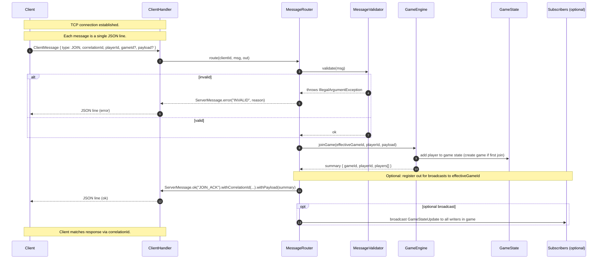

# Player Join Lobby Sequence (TCP -> Server)

```mermaid
sequenceDiagram
    autonumber
    participant C as Client
    participant CH as ClientHandler
    participant MR as MessageRouter
    participant MV as MessageValidator
    participant GE as GameEngine
    participant GS as GameState
    participant Subs as Subscribers (optional)

    Note over C,CH: TCP connection established.
    Note over C,CH: Each message is a single JSON line.

    C->>CH: ClientMessage { type: JOIN, correlationId, playerId, gameId?, payload? }
    CH->>MR: route(clientId, msg, out)
    MR->>MV: validate(msg)
    alt invalid
        MV-->>MR: throws IllegalArgumentException
        MR-->>CH: ServerMessage.error("INVALID", reason)
        CH-->>C: JSON line (error)
    else valid
        MV-->>MR: ok
    end

    MR->>GE: joinGame(effectiveGameId, playerId, payload)
    GE->>GS: add player to game state (create game if first join)
    GE-->>MR: summary { gameId, playerId, players[] }

    Note over MR,Subs: Optional: register out for broadcasts to effectiveGameId
    MR->>CH: ServerMessage.ok("JOIN_ACK").withCorrelationId(...).withPayload(summary)
    CH-->>C: JSON line (ok)

    opt optional broadcast
        MR->>Subs: broadcast GameStateUpdate to all writers in game
    end

    Note over C,CH: Client matches response via correlationId.
```