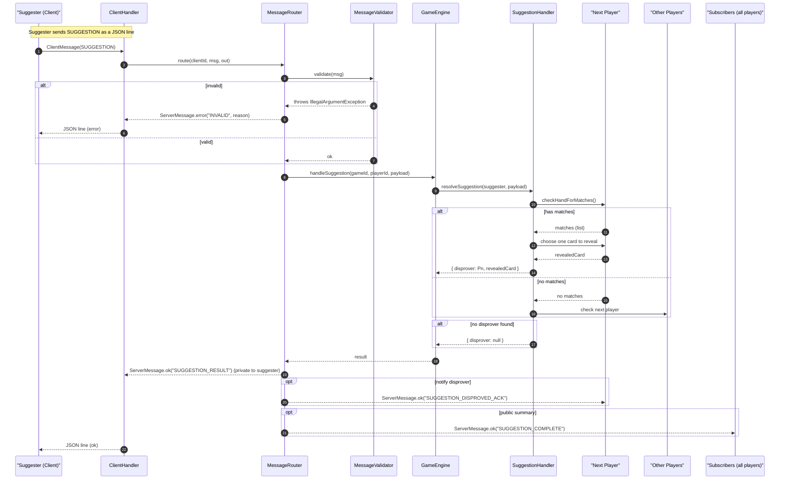

# Player Suggestion Sequence (TCP -> Server)

```mermaid
sequenceDiagram
    autonumber
    participant C as "Suggester (Client)"
    participant CH as ClientHandler
    participant MR as MessageRouter
    participant MV as MessageValidator
    participant GE as GameEngine
    participant SH as SuggestionHandler
    participant Pn as "Next Player"
    participant Pk as "Other Players"
    participant Subs as "Subscribers (all players)"

    Note over C,CH: Suggester sends SUGGESTION as a JSON line

    C->>CH: ClientMessage(SUGGESTION)
    CH->>MR: route(clientId, msg, out)
    MR->>MV: validate(msg)
    alt invalid
        MV-->>MR: throws IllegalArgumentException
        MR-->>CH: ServerMessage.error("INVALID", reason)
        CH-->>C: JSON line (error)
    else valid
        MV-->>MR: ok
    end

    MR->>GE: handleSuggestion(gameId, playerId, payload)
    GE->>SH: resolveSuggestion(suggester, payload)

    SH->>Pn: checkHandForMatches()
    alt has matches
        Pn-->>SH: matches (list)
        SH->>Pn: choose one card to reveal
        Pn-->>SH: revealedCard
        SH-->>GE: { disprover: Pn, revealedCard }
    else no matches
        Pn-->>SH: no matches
        SH->>Pk: check next player
    end

    alt no disprover found
        SH-->>GE: { disprover: null }
    end

    GE-->>MR: result

    MR-->>CH: ServerMessage.ok("SUGGESTION_RESULT") (private to suggester)
    opt notify disprover
        MR-->>Pn: ServerMessage.ok("SUGGESTION_DISPROVED_ACK")
    end
    opt public summary
        MR-->>Subs: ServerMessage.ok("SUGGESTION_COMPLETE")
    end

    CH-->>C: JSON line (ok)
```