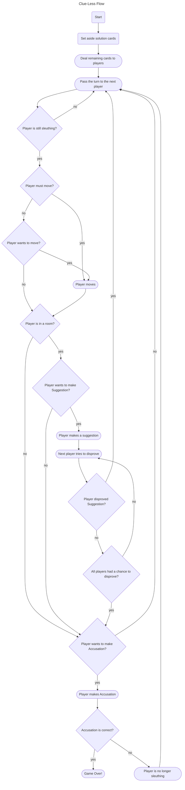

```mermaid
---
title: Clue-Less Flow
---

flowchart TD;

start(Start);
setSolution(Set aside solution cards);
deal([Deal remaining cards to players]);
nextPlayerTurn([Pass the turn to the next player]); 
stillSleuthing{Player is still sleuthing?}
mustMove{Player must move?};
wantsToMove{Player wants to move?};
move([Player moves]);
inRoom{Player is in a room?};
wantsToSuggest{Player wants to make Suggestion?};
wantsToAccuse{Player wants to make Accusation?};
suggest([Player makes a suggestion]);
nextDisprove([Next player tries to disprove]);
suggestionDisproved{Player disproved Suggestion?};
doneDisproving{All players had a chance to disprove?};
accuse([Player makes Accusation]);
accusationCorrect{Accusation is correct?};
noLongerSleuthing([Player is no longer sleuthing]);
gameOver([Game Over!])

start --> setSolution;
setSolution --> deal;
deal --> nextPlayerTurn;
stillSleuthing --> |yes| mustMove;
stillSleuthing -->|no| nextPlayerTurn;
nextPlayerTurn --> stillSleuthing;
mustMove --> |yes| move;
mustMove --> |no| wantsToMove;
wantsToMove --> |yes| move;
wantsToMove -->|no| inRoom;
move --> inRoom;
inRoom -->|yes| wantsToSuggest;
inRoom -->|no| wantsToAccuse;
wantsToSuggest -->|yes| suggest;
wantsToSuggest -->|no| wantsToAccuse; 
suggest --> nextDisprove;
nextDisprove --> suggestionDisproved;
suggestionDisproved -->|yes| nextPlayerTurn;
suggestionDisproved -->|no| doneDisproving;
doneDisproving -->|yes| wantsToAccuse;
doneDisproving -->|no| nextDisprove;
wantsToAccuse -->|no| nextPlayerTurn;
wantsToAccuse -->|yes| accuse;
accuse --> accusationCorrect;
accusationCorrect -->|yes| gameOver;
accusationCorrect -->|no| noLongerSleuthing;
noLongerSleuthing --> nextPlayerTurn;
```
