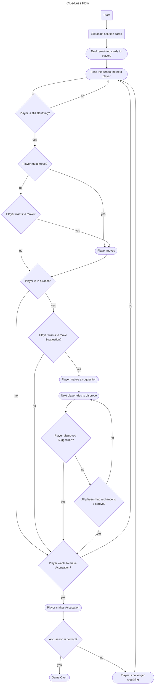

This flowchart captures the logic of game play in Clue-Less.

Nodes with rounded corners require the server to notify all players
of updated game information.

Definitions:
- sleuthing: able to move, make Suggestions, and make Accusations.  When a player has made an incorrect Accusation, they are no longer sleuthing.  A player who is not sleuthing continues to participate by attempting to disprove Suggestions made by other players.
- disproving: showing a card from your hand to another player to prove that a Suggestion is not the game solution.
- solution: the 3 cards that identify the suspect, weapon, and room of the murder.

