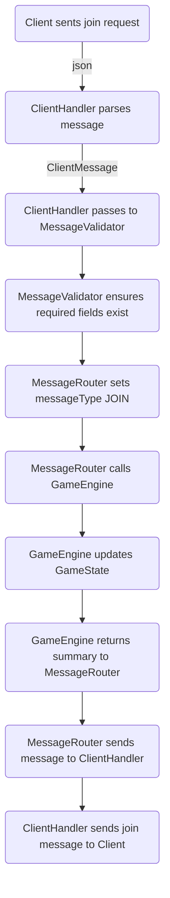

```mermaid
flowchart TD

joinReq(Client sents join request)-->|json|parse(ClientHandler parses message)
parse-->|ClientMessage|val1(ClientHandler passes to MessageValidator)
val1-->val2(MessageValidator ensures required fields exist)
val2-->route1(MessageRouter sets messageType JOIN)
route1-->callEng(MessageRouter calls GameEngine)
callEng-->setState(GameEngine updates GameState)
setState-->returnSummary(GameEngine returns summary to MessageRouter)
returnSummary-->returnMsg(MessageRouter sends message to ClientHandler)
returnMsg-->clientMsg(ClientHandler sends join message to Client)
```
