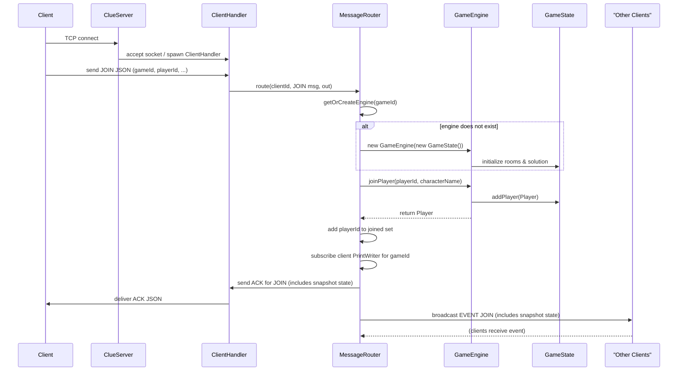

```mermaid
sequenceDiagram
    participant Client
    participant Server as ClueServer
    participant Handler as ClientHandler
    participant Router as MessageRouter
    participant Engine as GameEngine
    participant State as GameState
    participant Others as "Other Clients"

    Client->>Server: TCP connect
    Server->>Handler: accept socket / spawn ClientHandler
    Client->>Handler: send JOIN JSON (gameId, playerId, ...)

    Handler->>Router: route(clientId, JOIN msg, out)
    Router->>Router: getOrCreateEngine(gameId)
    alt engine does not exist
        Router->>Engine: new GameEngine(new GameState())
        Engine->>State: initialize rooms & solution
    end

    Router->>Engine: joinPlayer(playerId, characterName)
    Engine->>State: addPlayer(Player)
    Engine-->>Router: return Player

    Router->>Router: add playerId to joined set
    Router->>Router: subscribe client PrintWriter for gameId

    Router->>Handler: send ACK for JOIN (includes snapshot state)
    Handler->>Client: deliver ACK JSON

    Router->>Others: broadcast EVENT JOIN (includes snapshot state)
    Others-->>Router: (clients receive event)
```
